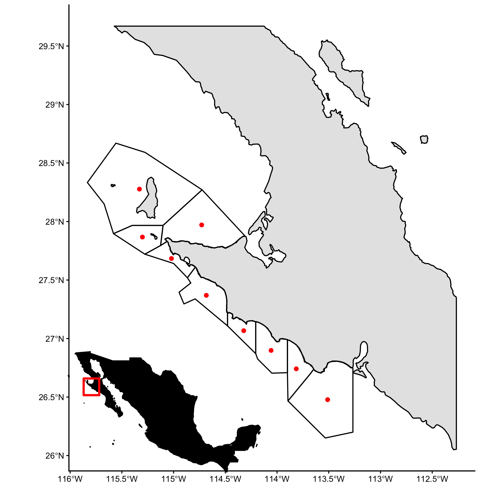

# FEDECOOP maps, distances, and abalone model


## Repository structure 

```
-- fedecoop.Rproj
-- raw_data
   |__conapesca.rds
   |__spatial
-- README.md
-- renv
-- renv.lock
   |__activate.R
   |__library
-- results
   |__distance_matrix.csv
   |__distance_table.csv
   |__img
-- scripts
   |__1_map_files
   |__1_map.md
   |__1_map.Rmd
   |__2_distances_files
   |__2_distances.md
   |__2_distances.Rmd
   |__3_abalone_fishery_files
   |__3_abalone_fishery.md
   |__3_abalone_fishery.Rmd
   |__4_abalone_model_files
   |__4_abalone_model.md
   |__4_abalone_model.Rmd
```

## Requested things

All the results, including pdf versions of the figures, can be found in the [results](results) folder.

### Map of the Cooperatives

To see more maps, go to [here](scripts/1_map.md).



### Distance between cooperatives


### Fishery data

An overview of landings data from all FEDECOOP cooperatives can be found [here](scripts\3_abalone_fishery). Their [website](https://www.fedecoop.com.mx/) states that aggregate landed green abalone (*H. fulgens*) meat is about 200 tones per year.

The figure below shows aggregate landings of *H. fulgens* for nine cooperative sin FEDECOOP. The solid hosiontal line shows the long-term mean, dashed lines represent $\pm$ 1 SD.


### Biology of abalone


--------- 

<a href="https://orcid.org/0000-0003-1245-589X" target="orcid.widget" rel="noopener noreferrer" style="vertical-align:top;">orcid.org/0000-0003-1245-589X</a>
