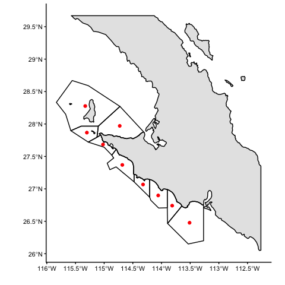

Map of nine TURFs
================
Juan Carlos Villaseñr-Derbez

# Intro

The Federation of Cooperatives (FEDECOOP) is a group of 9 fishing
cooperatives that. This Rmd file creates a map of these TURFS

# Coding

## Set up

### Load libraries

``` r
suppressPackageStartupMessages({
  library(startR)
  library(here)
  library(cowplot)
  library(rnaturalearth)
  library(sf)
  library(ggsflabel)
  library(SpatialPosition)
  library(tidyverse)
})
```

### Load data

Let’s load the data that contain the shapefiles for the 9 TURF polygons,
and transform it to longlat
coordinates.

``` r
turfs <- st_read(here("raw_data", "spatial",  "feddecoop_polygons.gpkg")) %>% 
  st_transform("+proj=longlat +datum=WGS84 +no_defs")
```

    ## Reading layer `feddecoop_polygons' from data source `/Users/juancarlosvillasenorderbez/GitHub/fedecoop/raw_data/spatial/feddecoop_polygons.gpkg' using driver `GPKG'
    ## Simple feature collection with 9 features and 9 fields
    ## geometry type:  POLYGON
    ## dimension:      XY
    ## bbox:           xmin: 614359.1 ymin: 2896921 xmax: 873150.6 ymax: 3172240
    ## projected CRS:  WGS 84 / UTM zone 11N

Let’s briefly visualize this data. It contains 9 features (TURFs) and 9
fields (columns). The columns are:

``` r
turfs %>% 
  st_drop_geometry() %>% 
  knitr::kable()
```

| OBJECTID | FID\_FEDECO | Coop                      |        Ha | FID\_cedros | Id | ET\_ID | Shape\_Leng | Shape\_Area |
| -------: | ----------: | :------------------------ | --------: | ----------: | -: | :----- | ----------: | ----------: |
|        1 |           1 | Bahia de Tortugas         |  48927.53 |         \-1 |  0 | NA     |    135346.8 |   489275313 |
|        2 |           2 | Buzos y Pescadores        |  82244.71 |         \-1 |  0 | NA     |    120709.6 |   822447132 |
|        3 |           3 | California de San Ignacio |  53313.56 |         \-1 |  0 | NA     |    122100.2 |   533135567 |
|        4 |           4 | Emancipacion              | 115689.08 |         \-1 |  0 | NA     |    176635.2 |  1156890844 |
|        5 |           5 | La Purisima               | 246787.77 |         \-1 |  0 | NA     |    230779.0 |  2467877738 |
|        6 |           6 | Leyes de Reforma          | 104477.07 |         \-1 |  0 | NA     |    143783.9 |  1044770741 |
|        7 |           7 | Progreso                  |  77856.35 |         \-1 |  0 | NA     |    138268.8 |   778563505 |
|        8 |           8 | Punta Abreojos            | 312745.47 |         \-1 |  0 | NA     |    226242.2 |  3127454736 |
|        9 |         \-1 | Isla Cedros               | 532470.33 |           1 |  0 | 0      |    293701.3 |  5324703275 |

We see that most columns are not very important for us. But the total
area might come in handy, so we’ll leave that there. Now, let’s rapidly
visualize them, using area to color them.

``` r
plot(turfs[ , 9])
```

<!-- -->

# Map

The first step is to build a publication-quality map. Something that
will probably end up as a supplementary figure.

First, we need the coastline for Mexico and Baja. Let’s get both from
the `rnaturalearth`
package.

``` r
mexico <- ne_countries(scale = 10, country = "Mexico", returnclass = "sf")
baja <- ne_states(country = "Mexico", returnclass = "sf") %>% 
  filter(name %in% c("Baja California", "Baja California Sur")) %>% 
  st_crop(st_buffer(st_as_sfc(st_bbox(turfs)), 1)) %>% 
  st_union()
```

Now let’s create a map of Mexico to use as reference map.

``` r
# Create a square based on the bounding box of the TURFs
square <- st_as_sfc(st_bbox(turfs))

# Create a reference map
mex_map <- ggplot() +
  geom_sf(data = mexico, color = "black", fill = "black") +
  geom_sf(data = square, fill = "transparent", size = 1, color = "red") +
  ggtheme_map() +
  theme(plot.background = element_blank())

# View the map
mex_map
```

<!-- -->

Now let’s create a map of the actual cooperatives. We might want to
include their names and locations too. So lets create a shapefile of
their sentroids first.

``` r
turf_centroids <- st_centroid(turfs) %>% 
  mutate(a = LETTERS[1:nrow(.)])
```

``` r
turf_map <- ggplot() +
  geom_sf(data = baja, color = "black") +
  geom_sf(data = turfs, fill = "transparent", color = "black") +
  geom_sf(data = turf_centroids, color = "red") +
  ggtheme_plot() +
  theme(legend.position = "top") +
  labs(x = "", y = "")

turf_map
```

<!-- -->

``` r
turf_map_with_text <- turf_map + 
    geom_sf_text_repel(data = turf_centroids, aes(label = Coop), nudge_x = 4, nudge_y = 0, min.segment.length = 0, seed = 2)

turf_map_with_text
```

<!-- -->

Now, lets combine them into a finalized plot that we can export.

``` r
map_final <- ggdraw() +
  draw_plot(turf_map) +
  draw_plot(mex_map, x = 0.1, y = -0.05, width = 0.45, height = 0.45)

map_final
```


``` r
map_final <- ggdraw() +
  draw_plot(turf_map_with_text) +
  draw_plot(mex_map, x = 0.1, y = -0.05, width = 0.45, height = 0.45)

map_final
```

<!-- -->

Export the figure

``` r
lazy_ggsave(plot = map_final,
            filename = "fedecoop_map",
            width = 17,
            height = 17)
```
