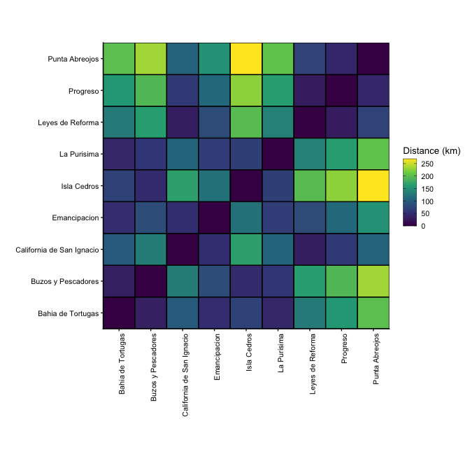

Distance between TURFs
================
Juan Carlos Villaseñr-Derbez

# Intro

The previous Rmd file created a figure to show the location of nine
TURFs that are part of FEDECOOP. This Rmd document will now calculate
the pairwise distances between all TURFs.

## Set up

### Load packages

``` r
suppressPackageStartupMessages({
  library(here)
  library(startR)
  library(units)
  library(sf)
  library(tidyverse)
})
```

### Load data

``` r
turfs <- st_read(here("raw_data", "spatial",  "feddecoop_polygons.gpkg")) %>% 
  st_centroid()
```

    ## Reading layer `feddecoop_polygons' from data source `/Users/juancarlosvillasenorderbez/GitHub/fedecoop/raw_data/spatial/feddecoop_polygons.gpkg' using driver `GPKG'
    ## Simple feature collection with 9 features and 9 fields
    ## geometry type:  POLYGON
    ## dimension:      XY
    ## bbox:           xmin: 614359.1 ymin: 2896921 xmax: 873150.6 ymax: 3172240
    ## projected CRS:  WGS 84 / UTM zone 11N

# Calculations

## Calculate distance between TURF centroids

We can now calculate the distance between all combinations of TURFs.
This will produce a 9 X 9 matrix with all distances (in km), with a
diagonal with valuea of 0.

``` r
# Assign rownames based on TURF name
rownames(turfs) <- turfs$Coop

# Calculate distance matrix (results are in meters)
matrix <- as.matrix(st_distance(turfs, turfs)) %>% 
  set_units(km)

colnames(matrix) <- turfs$Coop
rownames(matrix) <- turfs$Coop

matrix
```

    ## Units: [km]
    ##                           Bahia de Tortugas Buzos y Pescadores
    ## Bahia de Tortugas                   0.00000           34.36685
    ## Buzos y Pescadores                 34.36685            0.00000
    ## California de San Ignacio          97.18328          131.29001
    ## Emancipacion                       48.20886           82.27352
    ## La Purisima                        42.89460           57.56858
    ## Leyes de Reforma                  129.11863          163.34328
    ## Progreso                          158.76908          193.04624
    ## Punta Abreojos                    200.81062          235.06103
    ## Isla Cedros                        72.44570           45.48110
    ##                           California de San Ignacio Emancipacion La Purisima
    ## Bahia de Tortugas                          97.18328     48.20886    42.89460
    ## Buzos y Pescadores                        131.29001     82.27352    57.56858
    ## California de San Ignacio                   0.00000     49.01866   107.92611
    ## Emancipacion                               49.01866      0.00000    66.85773
    ## La Purisima                               107.92611     66.85773     0.00000
    ## Leyes de Reforma                           32.26091     81.10465   136.17114
    ## Progreso                                   62.08873    110.86493   163.63589
    ## Punta Abreojos                            103.90244    152.82802   204.90077
    ## Isla Cedros                               166.93908    119.08127    68.14903
    ##                           Leyes de Reforma  Progreso Punta Abreojos Isla Cedros
    ## Bahia de Tortugas                129.11863 158.76908      200.81062    72.44570
    ## Buzos y Pescadores               163.34328 193.04624      235.06103    45.48110
    ## California de San Ignacio         32.26091  62.08873      103.90244   166.93908
    ## Emancipacion                      81.10465 110.86493      152.82802   119.08127
    ## La Purisima                      136.17114 163.63589      204.90077    68.14903
    ## Leyes de Reforma                   0.00000  29.82785       71.72387   197.84202
    ## Progreso                          29.82785   0.00000       42.07509   226.76603
    ## Punta Abreojos                    71.72387  42.07509        0.00000   268.70713
    ## Isla Cedros                      197.84202 226.76603      268.70713     0.00000

``` r
knitr::kable(matrix)
```

|                           | Bahia de Tortugas | Buzos y Pescadores | California de San Ignacio |     Emancipacion |      La Purisima | Leyes de Reforma |         Progreso |   Punta Abreojos |      Isla Cedros |
| ------------------------- | ----------------: | -----------------: | ------------------------: | ---------------: | ---------------: | ---------------: | ---------------: | ---------------: | ---------------: |
| Bahia de Tortugas         |    0.00000 \[km\] |    34.36685 \[km\] |           97.18328 \[km\] |  48.20886 \[km\] |  42.89460 \[km\] | 129.11863 \[km\] | 158.76908 \[km\] | 200.81062 \[km\] |  72.44570 \[km\] |
| Buzos y Pescadores        |   34.36685 \[km\] |     0.00000 \[km\] |          131.29001 \[km\] |  82.27352 \[km\] |  57.56858 \[km\] | 163.34328 \[km\] | 193.04624 \[km\] | 235.06103 \[km\] |  45.48110 \[km\] |
| California de San Ignacio |   97.18328 \[km\] |   131.29001 \[km\] |            0.00000 \[km\] |  49.01866 \[km\] | 107.92611 \[km\] |  32.26091 \[km\] |  62.08873 \[km\] | 103.90244 \[km\] | 166.93908 \[km\] |
| Emancipacion              |   48.20886 \[km\] |    82.27352 \[km\] |           49.01866 \[km\] |   0.00000 \[km\] |  66.85773 \[km\] |  81.10465 \[km\] | 110.86493 \[km\] | 152.82802 \[km\] | 119.08127 \[km\] |
| La Purisima               |   42.89460 \[km\] |    57.56858 \[km\] |          107.92611 \[km\] |  66.85773 \[km\] |   0.00000 \[km\] | 136.17114 \[km\] | 163.63589 \[km\] | 204.90077 \[km\] |  68.14903 \[km\] |
| Leyes de Reforma          |  129.11863 \[km\] |   163.34328 \[km\] |           32.26091 \[km\] |  81.10465 \[km\] | 136.17114 \[km\] |   0.00000 \[km\] |  29.82785 \[km\] |  71.72387 \[km\] | 197.84202 \[km\] |
| Progreso                  |  158.76908 \[km\] |   193.04624 \[km\] |           62.08873 \[km\] | 110.86493 \[km\] | 163.63589 \[km\] |  29.82785 \[km\] |   0.00000 \[km\] |  42.07509 \[km\] | 226.76603 \[km\] |
| Punta Abreojos            |  200.81062 \[km\] |   235.06103 \[km\] |          103.90244 \[km\] | 152.82802 \[km\] | 204.90077 \[km\] |  71.72387 \[km\] |  42.07509 \[km\] |   0.00000 \[km\] | 268.70713 \[km\] |
| Isla Cedros               |   72.44570 \[km\] |    45.48110 \[km\] |          166.93908 \[km\] | 119.08127 \[km\] |  68.14903 \[km\] | 197.84202 \[km\] | 226.76603 \[km\] | 268.70713 \[km\] |   0.00000 \[km\] |

Now, lets convert the matrix into a table just in case this is useful.

``` r
distance_as_table <- matrix %>%
  as_tibble() %>% 
  mutate(from = colnames(.)) %>% 
  gather(to, value, -from) %>% 
  mutate(value = as.numeric(value))

distance_as_table
```

    ## # A tibble: 81 x 3
    ##    from                      to                 value
    ##    <chr>                     <chr>              <dbl>
    ##  1 Bahia de Tortugas         Bahia de Tortugas    0  
    ##  2 Buzos y Pescadores        Bahia de Tortugas   34.4
    ##  3 California de San Ignacio Bahia de Tortugas   97.2
    ##  4 Emancipacion              Bahia de Tortugas   48.2
    ##  5 La Purisima               Bahia de Tortugas   42.9
    ##  6 Leyes de Reforma          Bahia de Tortugas  129. 
    ##  7 Progreso                  Bahia de Tortugas  159. 
    ##  8 Punta Abreojos            Bahia de Tortugas  201. 
    ##  9 Isla Cedros               Bahia de Tortugas   72.4
    ## 10 Bahia de Tortugas         Buzos y Pescadores  34.4
    ## # … with 71 more rows

Now let’s visualize and export this matrix.

``` r
heatmap <- ggplot(data = distance_as_table,
       mapping = aes(x = from, y = to, fill = value)) +
  geom_tile(color = "black", size = 0.5) +
  coord_equal() +
  ggtheme_plot() +
  theme(axis.text.x = element_text(angle = 90, hjust = 1)) +
  guides(fill = guide_colorbar(ticks.colour = "black",
                               frame.colour = "black")) + 
  labs(x = "", y = "") +
  scale_fill_viridis_c(name = "Distance (km)") +
  scale_x_discrete(expand = c(0, 0)) +
  scale_y_discrete(expand = c(0, 0))

heatmap
```

<!-- -->

We can now export both, the matrix and table, as well as the figure.

``` r
write.csv(x = matrix,
          file = here::here("results", "distance_matrix.csv"))

write.csv(x = distance_as_table,
          file = here::here("results", "distance_table.csv"),
          row.names = F)

lazy_ggsave(plot = heatmap,
            filename = "distance_heatmap",
            width = 17,
            height = 17)
```
