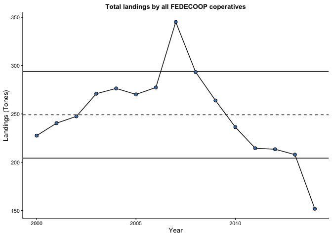
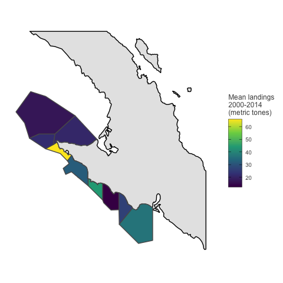
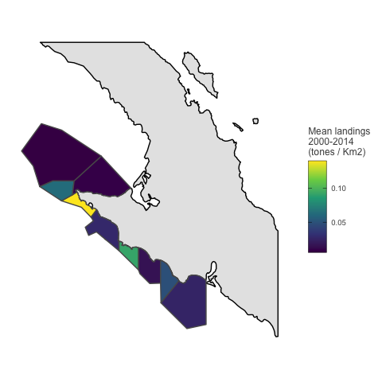

Abalone Fishery
================
Juan Carlos Villaseñr-Derbez

# Intro

This documents uses landings data from CONAPESCA (2000 - 2014). I will
create a monthly time series of landings and values for each
cooperative.

## Set up

### Load packages

### Load data

    ## Reading layer `fedecoop_polygons' from data source `/Users/juancarlosvillasenorderbez/GitHub/fedecoop/raw_data/spatial/fedecoop_polygons.gpkg' using driver `GPKG'
    ## Simple feature collection with 9 features and 9 fields
    ## geometry type:  POLYGON
    ## dimension:      XY
    ## bbox:           xmin: 614359.1 ymin: 2896921 xmax: 873150.6 ymax: 3172240
    ## projected CRS:  WGS 84 / UTM zone 11N

## Prepare data

This is some very messy data. We’ll first have to filter to include only
the nince cooperatives that are part of FEDECOOP. Then, we’ll keep only
data on abalone, and then filter again to keep only data on abalone
where weight is reported without accounting for abalone shell. Then I
will modify the coperative names so that they match the spatial dataset.

Once all teh filters and modifications are ready, I’ll then group data
at the coop-year level and create a timeseries of landings and value
associated with those landings.

The resulting table contins the total monthly landings and revenue (as
well as price) at the coop-year-month level. A preview of this panel is
this:

| year | coop                      | landed\_weight |
| ---: | :------------------------ | -------------: |
| 2000 | Bahia de Tortugas         |       64226.68 |
| 2000 | Buzos y Pescadores        |       63169.96 |
| 2000 | California de San Ignacio |       46966.92 |
| 2000 | Emancipacion              |        9322.46 |
| 2000 | Isla Cedros               |       15555.68 |
| 2000 | Leyes de Reforma          |        9522.38 |
| 2000 | Progreso                  |       41457.22 |
| 2000 | Punta Abreojos            |       53309.62 |
| 2001 | Bahia de Tortugas         |       66678.08 |
| 2001 | Buzos y Pescadores        |       68710.60 |
| 2001 | California de San Ignacio |       39986.38 |
| 2001 | Emancipacion              |       14280.00 |
| 2001 | Isla Cedros               |       28443.38 |
| 2001 | Leyes de Reforma          |       13056.68 |
| 2001 | Progreso                  |       38310.86 |
| 2001 | Punta Abreojos            |       49980.00 |
| 2002 | Bahia de Tortugas         |       70438.48 |
| 2002 | Buzos y Pescadores        |       65164.40 |
| 2002 | California de San Ignacio |       39984.00 |
| 2002 | Emancipacion              |       20458.48 |
| 2002 | Isla Cedros               |       25901.54 |
| 2002 | Leyes de Reforma          |       12811.54 |
| 2002 | Progreso                  |       37620.66 |
| 2002 | Punta Abreojos            |       55915.72 |

Landings (kg), revenue (MXP), and prices (MXP / Kg) for the abalone
fishery in 9 cooperatives belonging to FEDECOOP.

# Tables and Figures

## Total landings and revenues

Let’s create a table that shows the total landings for each cooperative
on any given
year.

| year  | Bahia de Tortugas | Buzos y Pescadores | California de San Ignacio | Emancipacion | Isla Cedros | La Purisima | Leyes de Reforma |  Progreso | Punta Abreojos |     Total |
| :---- | ----------------: | -----------------: | ------------------------: | -----------: | ----------: | ----------: | ---------------: | --------: | -------------: | --------: |
| 2000  |          64226.68 |           63169.96 |                  46966.92 |      9322.46 |    15555.68 |          NA |          9522.38 |  41457.22 |       53309.62 |  303530.9 |
| 2001  |          66678.08 |           68710.60 |                  39986.38 |     14280.00 |    28443.38 |          NA |         13056.68 |  38310.86 |       49980.00 |  319446.0 |
| 2002  |          70438.48 |           65164.40 |                  39984.00 |     20458.48 |    25901.54 |          NA |         12811.54 |  37620.66 |       55915.72 |  328294.8 |
| 2003  |          83554.66 |           63346.08 |                  39974.48 |     28550.48 |    28164.92 |          NA |         14860.72 |  42847.14 |       61285.00 |  362583.5 |
| 2004  |          83321.42 |           63148.54 |                  34862.24 |     36649.62 |    28950.32 |          NA |         17830.96 |  39703.16 |       62420.26 |  366886.5 |
| 2005  |          89647.46 |           67651.50 |                  46381.44 |     31106.60 |    33320.00 |          NA |         23300.20 |  28609.98 |       75208.00 |  395225.2 |
| 2006  |          91615.72 |           66551.94 |                  47083.54 |     32072.88 |    38065.72 |          NA |         29797.60 |  32610.76 |       79730.00 |  417528.2 |
| 2007  |          94019.52 |           66897.04 |                  47999.84 |     36909.04 |    39222.40 |     54423.0 |         28531.44 |  38351.32 |       90440.00 |  496793.6 |
| 2008  |          97394.36 |           67910.92 |                  48035.54 |     36885.24 |    39151.00 |          NA |         28560.00 |  38070.48 |       90440.00 |  446447.5 |
| 2009  |          78459.08 |           11926.18 |                  50898.68 |     39212.88 |    41431.04 |          NA |         12982.90 |  44758.28 |       91394.38 |  371063.4 |
| 2010  |          56879.62 |           12499.76 |                  56194.18 |     35395.36 |    34003.06 |      4016.0 |          2008.72 |  31637.34 |       90092.52 |  322726.6 |
| 2011  |          42675.78 |            4912.32 |                  60423.44 |     41531.00 |    24611.58 |          NA |           433.16 |  33193.86 |       83300.00 |  291081.1 |
| 2012  |          32586.96 |                 NA |                  62936.72 |     44063.32 |    26113.36 |          NA |               NA |  35714.28 |       92824.76 |  294239.4 |
| 2013  |           6242.74 |                 NA |                  68962.88 |     47481.00 |    27293.84 |      3439.1 |               NA |  40057.78 |      100738.26 |  294215.6 |
| 2014  |                NA |                 NA |                  42749.56 |     25942.00 |    29178.80 |          NA |               NA |  42316.40 |       96487.58 |  236674.3 |
| Total |         957740.56 |          621889.24 |                 733439.84 |    479860.36 |   459406.64 |     61878.1 |        193696.30 | 565259.52 |     1173566.10 | 5246736.7 |

Total landings (Kg) for each cooperative through time. NAs represent
missing data for a given year / cooperative combination.

<!-- -->

<!-- -->

## Mean measures

The tables and figures above show the totals for each year and across
all cooperatives. Let’s create one where we show the mean annual
landings and revenue for each cooperative, and then one where we look at
the grand mean.

| coop                      |     mean |        sd |
| :------------------------ | -------: | --------: |
| Bahia de Tortugas         | 68410.04 | 26320.573 |
| Buzos y Pescadores        | 51824.10 | 25486.544 |
| California de San Ignacio | 48895.99 |  9554.259 |
| Emancipacion              | 31990.69 | 10757.187 |
| Isla Cedros               | 30627.11 |  6918.571 |
| La Purisima               | 20626.03 | 29270.453 |
| Leyes de Reforma          | 16141.36 |  9866.574 |
| Progreso                  | 37683.97 |  4565.258 |
| Punta Abreojos            | 78237.74 | 17230.245 |

Annual Mean and SDlanded weigh for each cooperative.

<!-- -->

<!-- -->

<!-- -->

However, this analyses des not accout for the temporal trend in which
cooperatives have been forced to reduce fishing effort due to the
diwndling status of stocks. n FEDECOOPs website
(<https://www.fedecoop.com.mx/>), they report that total extraction
averages 290 metric tonnes for all cooperatives together. This value is
closer to the more recent values.
