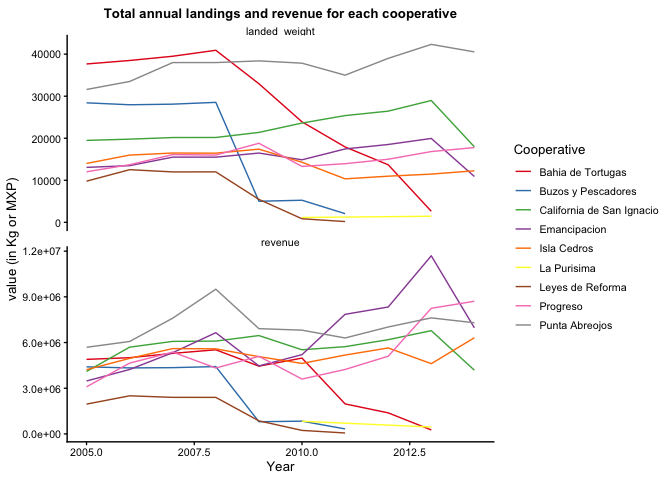
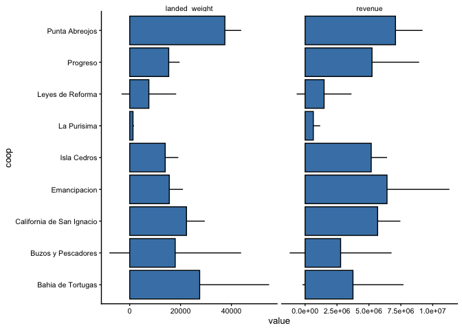

Abalone Fishery
================
Juan Carlos Villaseñr-Derbez

# Intro

This documents uses landings data from CONAPESCA (2000 - 2014). I will
create a monthly time series and values for each cooperative.

## Set up

### Load packages

``` r
suppressPackageStartupMessages({
  library(here)
  library(startR)
  library(sf)
  library(janitor)
  library(tidyverse)
})
```

### Load data

``` r
conapesca <- readRDS(here("raw_data", "conapesca.rds")) %>% 
  clean_names()

turfs <- st_read(here("raw_data", "spatial",  "fedecoop_polygons.gpkg"),
                 stringsAsFactors = F) 
```

    ## Reading layer `fedecoop_polygons' from data source `/Users/juancarlosvillasenorderbez/GitHub/fedecoop/raw_data/spatial/fedecoop_polygons.gpkg' using driver `GPKG'
    ## Simple feature collection with 9 features and 9 fields
    ## geometry type:  POLYGON
    ## dimension:      XY
    ## bbox:           xmin: 614359.1 ymin: 2896921 xmax: 873150.6 ymax: 3172240
    ## projected CRS:  WGS 84 / UTM zone 11N

## Prepare data

The first step is to filter the data for the 9 cooperatives of interest.
So I’ll filter the data, and group at the year-month level. Then I will
be able to know the total monthly landings and the value that these
fetched in the market.

``` r
# A list of the cooperatives I want
coops_i_want <- c("Scpp bahia tortugas s.c de r.l", "Scpp bahia tortugas s.c de r.l", "Scpp buzos y pescadores de la baja california scl", "Scpp california de san ignacio scl", "Scpp emancipacion sc de rl", "Scpp la purisima scl", "Soc coop de prod pesq rib leyes de reforma sc de rl", "Scpp progreso scl", "Scpp punta abreojos scl", "Scpp punta abreojos sc de rl", "Scpp pesc nacionales de abulon sc de rl")

# A list of the valid entries for abalone
abalone_types_i_want <- c(
  "Abulon amarillo s.c. fco.",
  # "Abulon amarillo ent. fco.",
  "Abulon chino s.c. fco.",
  # "Abulon chino ent. fco.",
  # "Abulon rayado ent. fco.",
  "Abulon rojo s.c. fco.",
  # "Abulon rojo ent. fco.",
  "Abulon azul s.c. fco.",
  # "Abulon azul ent. fco.",
  "Abulon blanco s.c. fco.",
  # "Abulon blanco ent. fco.",
  "Abulon negro s.c. fco.",
  # "Abulon negro ent. fco.",
  "Abulon s.c. fco."
  # "Abulon ent. fco."
  )

# A clearn list of cooepratives, so that databases match between them
coop_dictionary <- tibble(
  coop = turfs$coop,
  unidad_economica = c("bahia tortugas",
                       "buzos y pescadores la baja california",
                       "california san ignacio",
                       "emancipacion",
                       "pesc nacionales abulon",
                       "la purisima",
                       "soc leyes reforma",
                       "progreso",
                       "punta abreojos"))

# A month dictionary
month_dictionary <- tibble(
  month = 1:12,
  mes = c("Enero",
          "Febrero",
          "Marzo",
          "Abril",
          "Mayo",
          "Junio",
          "Julio",
          "Agosto",
          "Septiembre",
          "Octubre",
          "Noviembre",
          "Diciembre"))
# Now, filter, clean, and group by
abalone_fishery <- conapesca %>% 
  filter(ano >= 2005) %>% 
  filter(unidad_economica %in% coops_i_want) %>% 
  filter(str_detect(nombre_principal, "Abulon")) %>%
  filter(nombre_comun %in% abalone_types_i_want) %>% 
  mutate(peso = peso_desembarcado) %>% 
  # mutate(tipo = ifelse(str_detect(nombre_comun, "s.c."), "sin_concha", "entero")) %>% 
  select(unidad_economica,
         mes,
         year = ano,
         landed_weight = peso,
         revenue = valor) %>% 
  mutate(unidad_economica = tolower(unidad_economica),
         unidad_economica = str_remove_all(unidad_economica, "scpp "),
         unidad_economica = str_remove_all(unidad_economica, "coop de prod pesq rib"),
         unidad_economica = str_remove_all(unidad_economica, "de"),
         unidad_economica = str_remove_all(unidad_economica, " scl"),
         unidad_economica = str_remove_all(unidad_economica, " sc"),
         unidad_economica = str_remove_all(unidad_economica, " rl"),
         unidad_economica = str_remove_all(unidad_economica, " s.c."),
         unidad_economica = str_remove_all(unidad_economica, " r.l."),
         unidad_economica = str_remove_all(unidad_economica, " r.l"),
         unidad_economica = str_trim(unidad_economica),
         unidad_economica = str_squish(unidad_economica)) %>% 
  left_join(coop_dictionary, by = "unidad_economica") %>% 
  left_join(month_dictionary, by = "mes") %>% 
  select(coop, year, month, landed_weight, revenue) %>% 
  group_by(year, month, coop) %>% 
  summarize(landed_weight = sum(landed_weight, na.rm = T),
            revenue = sum(revenue, na.rm = T)) %>% 
  ungroup() %>% 
  mutate(price = revenue / landed_weight) %>% 
  arrange(year, month, coop)
```

The resulting table contins the total monthly landings and revenue (as
well as price) at the coop-year-month level. A preview of this panel is
this:

``` r
head(abalone_fishery, 24) %>% 
  knitr::kable(caption = "Landings (kg), revenue (MXP), and prices (MXP / Kg) for the abalone fishery in 9 cooperatives belonging to FEDECOOP.")
```

| year | month | coop                      | landed\_weight | revenue |    price |
| ---: | ----: | :------------------------ | -------------: | ------: | -------: |
| 2005 |     3 | Bahia de Tortugas         |           4368 |  567840 | 130.0000 |
| 2005 |     3 | Buzos y Pescadores        |           9169 | 1421195 | 155.0000 |
| 2005 |     3 | California de San Ignacio |           6282 | 1256400 | 200.0000 |
| 2005 |     3 | Isla Cedros               |            695 |  216145 | 311.0000 |
| 2005 |     3 | Punta Abreojos            |          15003 | 2700540 | 180.0000 |
| 2005 |     4 | Bahia de Tortugas         |          12497 | 1624610 | 130.0000 |
| 2005 |     4 | Buzos y Pescadores        |          11914 | 1845897 | 154.9351 |
| 2005 |     4 | California de San Ignacio |           9067 | 1958472 | 216.0000 |
| 2005 |     4 | Emancipacion              |           4105 | 1070319 | 260.7354 |
| 2005 |     4 | Isla Cedros               |           6151 | 1866548 | 303.4544 |
| 2005 |     4 | Leyes de Reforma          |           5760 | 1152000 | 200.0000 |
| 2005 |     4 | Progreso                  |           1995 |  680295 | 341.0000 |
| 2005 |     4 | Punta Abreojos            |          14318 | 2577240 | 180.0000 |
| 2005 |     5 | Bahia de Tortugas         |           9234 | 1200420 | 130.0000 |
| 2005 |     5 | Buzos y Pescadores        |           7342 | 1138010 | 155.0000 |
| 2005 |     5 | California de San Ignacio |           3726 |  804816 | 216.0000 |
| 2005 |     5 | Emancipacion              |           7044 | 1902558 | 270.0963 |
| 2005 |     5 | Isla Cedros               |           5444 | 1627756 | 299.0000 |
| 2005 |     5 | Leyes de Reforma          |           3796 |  759200 | 200.0000 |
| 2005 |     5 | Progreso                  |           5995 | 1426810 | 238.0000 |
| 2005 |     5 | Punta Abreojos            |           2279 |  410220 | 180.0000 |
| 2005 |     6 | Bahia de Tortugas         |           6935 |  901550 | 130.0000 |
| 2005 |     6 | Emancipacion              |           1921 |  503302 | 262.0000 |
| 2005 |     6 | Isla Cedros               |           1710 |  507870 | 297.0000 |

Landings (kg), revenue (MXP), and prices (MXP / Kg) for the abalone
fishery in 9 cooperatives belonging to FEDECOOP.

# Tables and Figures

## Total landings and revenues

Let’s create a table that shows the total landings for each cooperative
on any given year.

``` r
abalone_fishery %>% 
  group_by(year, coop) %>% 
  summarize(landings = sum(landed_weight, na.rm = T)) %>% 
  ungroup() %>% 
  spread(coop, landings) %>% 
  adorn_totals(where = c("row", "col"), na.rm = T) %>% 
  knitr::kable(caption = "Total landings (Kg) for each cooperative through time. NAs represent missing data for a given year / cooperative combination.")
```

| year  | Bahia de Tortugas | Buzos y Pescadores | California de San Ignacio | Emancipacion | Isla Cedros | La Purisima | Leyes de Reforma | Progreso | Punta Abreojos |   Total |
| :---- | ----------------: | -----------------: | ------------------------: | -----------: | ----------: | ----------: | ---------------: | -------: | -------------: | ------: |
| 2005  |             37667 |              28425 |                     19488 |        13070 |       14000 |          NA |             9790 |    12021 |          31600 |  166061 |
| 2006  |             38494 |              27963 |                     19783 |        13476 |       15994 |          NA |            12520 |    13702 |          33500 |  175432 |
| 2007  |             39504 |              28108 |                     20168 |        15508 |       16480 |          NA |            11988 |    16114 |          38000 |  185870 |
| 2008  |             40922 |              28534 |                     20183 |        15498 |       16450 |          NA |            12000 |    15996 |          38000 |  187583 |
| 2009  |             32966 |               5011 |                     21386 |        16476 |       17408 |          NA |             5455 |    18806 |          38401 |  155909 |
| 2010  |             23899 |               5252 |                     23611 |        14872 |       14287 |        1150 |              844 |    13293 |          37854 |  135062 |
| 2011  |             17931 |               2064 |                     25388 |        17450 |       10341 |          NA |              182 |    13947 |          35000 |  122303 |
| 2012  |             13692 |                 NA |                     26444 |        18514 |       10972 |          NA |               NA |    15006 |          39002 |  123630 |
| 2013  |              2623 |                 NA |                     28976 |        19950 |       11468 |        1445 |               NA |    16831 |          42327 |  123620 |
| 2014  |                NA |                 NA |                     17962 |        10900 |       12260 |          NA |               NA |    17780 |          40541 |   99443 |
| Total |            247698 |             125357 |                    223389 |       155714 |      139660 |        2595 |            52779 |   153496 |         374225 | 1474913 |

Total landings (Kg) for each cooperative through time. NAs represent
missing data for a given year / cooperative combination.

Now, let’s look at the total revenues in the same way

``` r
abalone_fishery %>% 
  group_by(year, coop) %>% 
  summarize(revenues = sum(revenue, na.rm = T)) %>% 
  ungroup() %>% 
  spread(coop, revenues) %>% 
  adorn_totals(where = c("row", "col"), na.rm = T) %>% 
  knitr::kable(caption = "Total revenues (MXP) for each cooperative through time. NAs represent missing data for a given year / cooperative combination.")
```

| year  | Bahia de Tortugas | Buzos y Pescadores | California de San Ignacio | Emancipacion | Isla Cedros | La Purisima | Leyes de Reforma | Progreso | Punta Abreojos |     Total |
| :---- | ----------------: | -----------------: | ------------------------: | -----------: | ----------: | ----------: | ---------------: | -------: | -------------: | --------: |
| 2005  |           4896710 |            4405102 |                   4102288 |      3476179 |     4218319 |          NA |          1958000 |  3092609 |        5688000 |  31837207 |
| 2006  |           5004220 |            4334162 |                   5697504 |      4231494 |     4960677 |          NA |          2504000 |  4650583 |        6070360 |  37453000 |
| 2007  |           5289730 |            4351943 |                   6075308 |      5334344 |     5603200 |          NA |          2401480 |  5373548 |        7600000 |  42029553 |
| 2008  |           5524470 |            4422770 |                   6095266 |      6646860 |     5586255 |          NA |          2400000 |  4329218 |        9500000 |  44504839 |
| 2009  |           4450410 |             801760 |                   6458572 |      4464404 |     5075320 |          NA |           859450 |  5096426 |        6912180 |  34118522 |
| 2010  |           4979180 |             840320 |                   5524974 |      5205200 |     4628428 |      833750 |           232225 |  3602403 |        6813720 |  32660200 |
| 2011  |           1972410 |             330240 |                   5729708 |      7852500 |     5177915 |          NA |            63700 |  4232430 |        6300000 |  31658903 |
| 2012  |           1384260 |                 NA |                   6187896 |      8331300 |     5645447 |          NA |               NA |  5102040 |        7020360 |  33671303 |
| 2013  |            262300 |                 NA |                   6780384 |     11694820 |     4612651 |      455175 |               NA |  8247190 |        7618860 |  39671380 |
| 2014  |                NA |                 NA |                   4183508 |      6964520 |     6313900 |          NA |               NA |  8712200 |        7297380 |  33471508 |
| Total |          33763690 |           19486297 |                  56835408 |     64201621 |    51822112 |     1288925 |         10418855 | 52438647 |       70820860 | 361076415 |

Total revenues (MXP) for each cooperative through time. NAs represent
missing data for a given year / cooperative combination.

``` r
abalone_fishery %>% 
  group_by(coop) %>% 
  summarize(landed_weight = sum(landed_weight, na.rm = T),
            revenue = sum(revenue, na.rm = T)) %>% 
  ungroup() %>% 
  mutate(price = revenue / landed_weight) %>% 
  knitr::kable(caption = "Annual mean landed weight, revenue, and price of abalone for each cooperative.")
```

| coop                      | landed\_weight |  revenue |    price |
| :------------------------ | -------------: | -------: | -------: |
| Bahia de Tortugas         |         247698 | 33763690 | 136.3099 |
| Buzos y Pescadores        |         125357 | 19486297 | 155.4464 |
| California de San Ignacio |         223389 | 56835408 | 254.4235 |
| Emancipacion              |         155714 | 64201621 | 412.3047 |
| Isla Cedros               |         139660 | 51822112 | 371.0591 |
| La Purisima               |           2595 |  1288925 | 496.6956 |
| Leyes de Reforma          |          52779 | 10418855 | 197.4053 |
| Progreso                  |         153496 | 52438647 | 341.6288 |
| Punta Abreojos            |         374225 | 70820860 | 189.2467 |

Annual mean landed weight, revenue, and price of abalone for each
cooperative.

``` r
abalone_fishery %>% 
  gather(variable, value, -c(year, month, coop)) %>% 
  filter(!variable == "price") %>% 
  ggplot(mapping = aes(x = year, y = value, color = coop, fill = coop)) +
  stat_summary(geom = "line", fun = sum) +
  facet_wrap(~variable, scales = "free_y", ncol = 1) +
  scale_color_brewer(name = "Cooperative", palette = "Set1") +
  ggtheme_plot() +
  ggtitle("Total annual landings and revenue for each cooperative") +
  labs(x = "Year", y = "value (in Kg or MXP)")
```

<!-- -->

``` r
abalone_fishery %>% 
  select(coop, landed_weight, revenue) %>% 
  gather(variable, value, -coop) %>% 
  ggplot(aes(x = coop, y = value)) +
  stat_summary(geom = "col", fun = sum, na.rm = T, color = "black", fill = "steelblue") +
  facet_wrap(~variable, scales = "free_x", ncol = 1)+
  ggtitle("Total landings and revenue for each cooperatives") +
  labs(x = "Year", y = "value (in Kg or MXP)") +
  ggtheme_plot() +
  coord_flip()
```

<!-- -->

``` r
abalone_fishery %>% 
  select(year, landed_weight, revenue) %>% 
  gather(variable, value, -year) %>% 
  ggplot(aes(x = year, y = value)) +
  stat_summary(geom = "line", fun = sum, na.rm = T, color = "black") +
  stat_summary(geom = "point", fun = sum, na.rm = T, color = "black", fill = "steelblue", shape = 21, size = 2) +
  facet_wrap(~variable, scales = "free_y", ncol = 1)+
  ggtitle("Total landings, and revenue for each cooperatives") +
  labs(x = "Year", y = "value (in Kg or MXP)") +
  ggtheme_plot()
```

<!-- -->

## Mean measures

The tables and figures above show the totals for each year and across
all cooperatives. Let’s create one where we show the mean annual
landings and revenue for each cooperative, and then one where we look at
the grand mean.

``` r
abalone_fishery %>% 
  group_by(year, coop) %>% 
  summarize(landed_weight = sum(landed_weight, na.rm = T),
            revenue = sum(revenue, na.rm = T)) %>% 
  ungroup() %>% 
  select(-year) %>% 
  group_by(coop) %>% 
  summarize_all(mean, na.rm = T) %>% 
  ungroup() %>% 
  knitr::kable(caption = "Annual mean landed weight and revenue for each cooperative.")
```

| coop                      | landed\_weight |   revenue |
| :------------------------ | -------------: | --------: |
| Bahia de Tortugas         |      27522.000 | 3751521.1 |
| Buzos y Pescadores        |      17908.143 | 2783756.8 |
| California de San Ignacio |      22338.900 | 5683540.8 |
| Emancipacion              |      15571.400 | 6420162.1 |
| Isla Cedros               |      13966.000 | 5182211.2 |
| La Purisima               |       1297.500 |  644462.5 |
| Leyes de Reforma          |       7539.857 | 1488407.9 |
| Progreso                  |      15349.600 | 5243864.7 |
| Punta Abreojos            |      37422.500 | 7082086.0 |

Annual mean landed weight and revenue for each cooperative.

``` r
abalone_fishery %>% 
  select(coop, year, landed_weight, revenue) %>% 
  group_by(coop, year) %>% 
  summarize_all(sum, na.rm = T) %>% 
  ungroup() %>% 
  gather(variable, value, -c(year, coop)) %>% 
  ggplot(aes(x = coop, y = value)) +
  stat_summary(geom = "errorbar", fun.data = mean_sdl, width = 0) +
  stat_summary(geom = "col", fun = mean, fill = "steelblue", color = "black") +
  ggtheme_plot() +
  coord_flip() +
  facet_wrap(~variable, scales = "free_x")
```

<!-- -->

``` r
mean_landings <- abalone_fishery %>% 
  group_by(year, coop) %>% 
  summarize(landed_weight = sum(landed_weight, na.rm = T),
            revenue = sum(revenue, na.rm = T)) %>% 
  ungroup() %>% 
  pull(landed_weight) %>% 
  mean()
```

``` r
mean_revenues <- abalone_fishery %>% 
  group_by(year, coop) %>% 
  summarize(landed_weight = sum(landed_weight, na.rm = T),
            revenue = sum(revenue, na.rm = T)) %>% 
  ungroup() %>% 
  pull(revenue) %>% 
  mean()
```

For any given year, a cooperative harvests an average of 19.6655067
metric tons of abalone, which can represent an average of 4.8143522
million mexican pesos (MXP). This implies that the average price is
244.8120095 pesos per kilogram.

However, this analyses des not accout for the temporal trend in which
cooperatives have been forced to reduce fishing effort due to the
diwndling status of stocks. n FEDECOOPs website
(<https://www.fedecoop.com.mx/>), they report that total extraction
averages 290 metric tonnes for all cooperatives together. This value is
closer to the more recent values.
