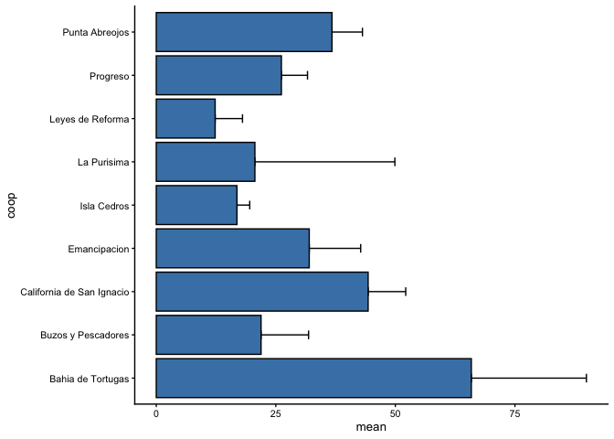

Abalone Fishery
================
Juan Carlos Villaseñr-Derbez

# Intro

This documents uses landings data from CONAPESCA (2000 - 2014). I will
create a monthly time series of landings and values for each
cooperative.

## Set up

### Load packages

### Load data

    ## Reading layer `fedecoop_polygons' from data source `/Users/juancarlosvillasenorderbez/GitHub/fedecoop/raw_data/spatial/fedecoop_polygons.gpkg' using driver `GPKG'
    ## Simple feature collection with 9 features and 9 fields
    ## geometry type:  POLYGON
    ## dimension:      XY
    ## bbox:           xmin: 614359.1 ymin: 2896921 xmax: 873150.6 ymax: 3172240
    ## CRS:            32611

## Prepare data

Thes are some very messy data. We’ll first have to filter it to keep
only the nince cooperatives that are part of FEDECOOP. Then, we’ll keep
only data on abalone, and then filter again to keep only data on abalone
where weight is reported without accounting for abalone shell. Then I
will modify the coperative names so that they match the spatial dataset.

Once all the filters and modifications are ready, I’ll then group data
at the coop-year level and create a time series of landings. Landings
data will be reported in metric tones. The resulting table contins the
total annual landings at the coop level. A preview of this panel is
this:

| year | coop                      | landed\_weight |
| ---: | :------------------------ | -------------: |
| 2000 | Bahia de Tortugas         |       64.22668 |
| 2000 | Buzos y Pescadores        |       26.40134 |
| 2000 | California de San Ignacio |       45.18906 |
| 2000 | Emancipacion              |        9.32246 |
| 2000 | Isla Cedros               |       10.00552 |
| 2000 | Leyes de Reforma          |        9.52238 |
| 2000 | Progreso                  |       34.52904 |
| 2000 | Punta Abreojos            |       28.31962 |
| 2001 | Bahia de Tortugas         |       66.67808 |
| 2001 | Buzos y Pescadores        |       30.77816 |
| 2001 | California de San Ignacio |       38.08238 |
| 2001 | Emancipacion              |       14.28000 |
| 2001 | Isla Cedros               |       16.58860 |
| 2001 | Leyes de Reforma          |       13.05668 |
| 2001 | Progreso                  |       33.58418 |
| 2001 | Punta Abreojos            |       27.37000 |
| 2002 | Bahia de Tortugas         |       70.43848 |
| 2002 | Buzos y Pescadores        |       27.89122 |
| 2002 | California de San Ignacio |       36.89000 |
| 2002 | Emancipacion              |       20.45848 |
| 2002 | Isla Cedros               |       15.72228 |
| 2002 | Leyes de Reforma          |       12.81154 |
| 2002 | Progreso                  |       32.33944 |
| 2002 | Punta Abreojos            |       30.91382 |

Landings (kg), revenue (MXP), and prices (MXP / Kg) for the abalone
fishery in 9 cooperatives belonging to FEDECOOP.

# Tables and Figures

## Total landings

Let’s create a table that shows the total landings for each cooperative
on any given year. We’ll also add row total and column
totals.

| year  | Bahia de Tortugas | Buzos y Pescadores | California de San Ignacio | Emancipacion | Isla Cedros | La Purisima | Leyes de Reforma |  Progreso | Punta Abreojos |     Total |
| :---- | ----------------: | -----------------: | ------------------------: | -----------: | ----------: | ----------: | ---------------: | --------: | -------------: | --------: |
| 2000  |          64.22668 |           26.40134 |                  45.18906 |      9.32246 |    10.00552 |          NA |          9.52238 |  34.52904 |       28.31962 |  227.5161 |
| 2001  |          66.67808 |           30.77816 |                  38.08238 |     14.28000 |    16.58860 |          NA |         13.05668 |  33.58418 |       27.37000 |  240.4181 |
| 2002  |          70.43848 |           27.89122 |                  36.89000 |     20.45848 |    15.72228 |          NA |         12.81154 |  32.33944 |       30.91382 |  247.4653 |
| 2003  |          83.55466 |           31.20180 |                  36.88524 |     28.55048 |    15.70800 |          NA |         14.86072 |  33.28430 |       26.84640 |  270.8916 |
| 2004  |          83.32142 |           30.14746 |                  33.07724 |     36.64962 |    14.90832 |          NA |         16.03644 |  29.59768 |       32.62266 |  276.3608 |
| 2005  |          85.11594 |           24.01896 |                  42.81620 |     31.10660 |    16.67666 |          NA |         16.66000 |  18.53782 |       35.22400 |  270.1562 |
| 2006  |          82.49556 |           23.79524 |                  42.80906 |     32.07288 |    19.02334 |          NA |         17.43826 |  20.70124 |       39.00820 |  277.3438 |
| 2007  |          84.91126 |           23.83332 |                  42.81620 |     36.90904 |    19.01144 |     54.4230 |         16.63144 |  24.94954 |       41.61430 |  345.0995 |
| 2008  |          88.65500 |           26.49654 |                  42.76860 |     36.88524 |    18.77820 |          NA |         16.66000 |  22.61238 |       40.46000 |  293.3160 |
| 2009  |          74.64156 |            7.52794 |                  45.37708 |     39.21288 |    18.80200 |          NA |         11.68818 |  28.19348 |       38.46794 |  263.9111 |
| 2010  |          56.87962 |            8.15150 |                  51.48892 |     35.39536 |    20.44420 |      4.0160 |          2.00872 |  20.20858 |       37.74918 |  236.3421 |
| 2011  |          42.67578 |            2.70844 |                  54.53770 |     41.53100 |    14.27524 |          NA |          0.43316 |  20.23000 |       38.08000 |  214.4713 |
| 2012  |          32.58696 |                 NA |                  55.84670 |     44.06332 |    15.48190 |          NA |               NA |  22.62428 |       42.84238 |  213.4455 |
| 2013  |           6.24274 |                 NA |                  59.46430 |     47.48100 |    18.94718 |      3.4391 |               NA |  24.67346 |       47.60000 |  207.8478 |
| 2014  |                NA |                 NA |                  36.54728 |     25.94200 |    18.77106 |          NA |               NA |  26.43228 |       44.10378 |  151.7964 |
| Total |         922.42374 |          262.95192 |                 664.59596 |    479.86036 |   253.14394 |     61.8781 |        147.80752 | 392.49770 |      551.22228 | 3736.3815 |

Total landings (Kg) for each cooperative through time. NAs represent
missing data for a given year / cooperative combination.

The table above is shown in the figures below. The first figure shows
the timseries of landed abalone for each cooperative. The second figure
shows the aggregate abalone landings for all FEDECOOP cooperatives.

<!-- -->

<!-- -->

## Mean measures

The tables and figures above show the totals for each year and across
all cooperatives. Let’s create one where we show the mean annual
landings and revenue for each cooperative, and then one where we look at
the grand mean.

| coop                      |     mean |        sd |
| :------------------------ | -------: | --------: |
| Bahia de Tortugas         | 65.88741 | 24.065569 |
| Buzos y Pescadores        | 21.91266 |  9.937815 |
| California de San Ignacio | 44.30640 |  7.861730 |
| Emancipacion              | 31.99069 | 10.757187 |
| Isla Cedros               | 16.87626 |  2.668767 |
| La Purisima               | 20.62603 | 29.270453 |
| Leyes de Reforma          | 12.31729 |  5.715633 |
| Progreso                  | 26.16651 |  5.460040 |
| Punta Abreojos            | 36.74815 |  6.368016 |

Annual Mean and SD landed weigh for each cooperative.

<!-- -->

<!-- -->

<!-- -->

Based on the 2000 - 2014 data, a cooperative’s mean catch is 32.2101855
\(\pm\) 19.3681749 tones (mean \(\pm\) SD). Total annual extraction to
be 249.0921013 \(\pm\) 44.8777944 (mean \(\pm\) SD). In FEDECOOPs
website (<https://www.fedecoop.com.mx/>), they report that current total
abalone extraction averages 290 metric tonnes for all cooperatives
together. This value is closer to the more recent value in these data.

However, this analyses des not accout for the temporal trend in which
cooperatives have been forced to reduce fishing effort due to the
diwndling status of stocks. I
