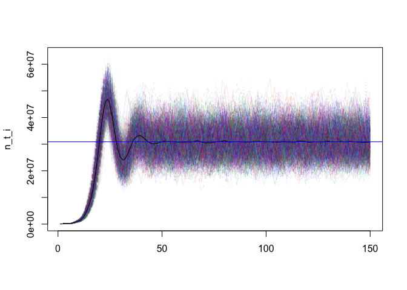

Abalone Fishery
================
Juan Carlos Villaseñr-Derbez

# Intro

This documents constructs a spatially-explicit and size-structured model
for Abalones in Marine Reserve contexts. This is a reconstru tion of the
2015 paper by Marissa Rosetto:

> Rossetto, M., Micheli, F., Saenz-Arroyo, A., Montes, J. A. E., & De
> Leo, G. A. (2015). No-take marine reserves can enhance population
> persistence and support the fishery of abalone. Canadian Journal of
> Fisheries and Aquatic Sciences, 72(10), 1503-1517.

## Set up

### Load packages

# Model

The model has 150 patches, each of which represent a 100 X 500 m parcel
(*i.e.* 5 hectares). The population contains 9 size classes, in 25 mm
increments. Density-dependence occurs during settlement of larvae.

## Define model parameters and components

All these parameters are presented roughly in the same order as Table 1
in Rosstto et al 2015.

### Index and spatial variables

### Lenght and mass

### Harvest

### Natural Mortality

In abalone, natural mortality rates of settled individuals have been
shown to be size-dependent, with survival probabilities increasing with
size (Rossetto et al. 2012). Accordingly, size-specific mortality rates
\(\mu_i\) (year−1) were calculated from mean body mass in each size
class wi (g) using the empirical allometric relationship between
instantaneous mortality rates and body mass reported for abalones in
natural environments (Rossetto et al. 2012):

\[
ln(\mu_i) = \theta + \alpha ln(l_i)
\] Annual survival si (i.e., the fraction of individuals in class i that
survive to the following year) was then computed as:

\[
s_i = e^{-\mu_i}
\]

### Somatic growth

From Table A1 - "Growth transition g\_{i,j}, from initial class j to
final class
    i

    ##          5–30 30–55 55–80 80–105 105–130 130–155 155–180 180–205 205–230
    ## 5–30    0.166 0.000 0.000  0.000   0.000   0.000   0.000   0.000       0
    ## 30–55   0.590 0.020 0.000  0.000   0.000   0.000   0.000   0.000       0
    ## 55–80   0.242 0.533 0.014  0.000   0.000   0.000   0.000   0.000       0
    ## 80–105  0.003 0.429 0.553  0.028   0.000   0.000   0.000   0.000       0
    ## 105–130 0.000 0.018 0.424  0.770   0.102   0.000   0.000   0.000       0
    ## 130–155 0.000 0.000 0.008  0.202   0.878   0.317   0.000   0.000       0
    ## 155–180 0.000 0.000 0.000  0.000   0.020   0.683   0.549   0.000       0
    ## 180–205 0.000 0.000 0.000  0.000   0.000   0.000   0.451   0.694       0
    ## 205–230 0.000 0.000 0.000  0.000   0.000   0.000   0.000   0.306       1

### Fecundity

### Larval and settler survival

### Larval dispersal

    ## [1] 0.99

<!-- -->

For simplicity, I’ll create a connectivity matrix.

<!-- -->

Then, settlers are just a function of the number of eggs produced, and
where they end up in

## Building the model

### Transition Matrix \(M\)

The transition matrix needs three pieces of information. Growth,
survival, and
    harvest.

    ##                5–30       30–55       55–80     80–105     105–130   130–155
    ## 5–30    0.011548780 0.000000000 0.000000000 0.00000000 0.000000000 0.0000000
    ## 30–55   0.209394563 0.007098121 0.000000000 0.00000000 0.000000000 0.0000000
    ## 55–80   0.128516748 0.283055482 0.007434853 0.00000000 0.000000000 0.0000000
    ## 80–105  0.001908202 0.272872863 0.351745205 0.01780988 0.000000000 0.0000000
    ## 105–130 0.000000000 0.012675777 0.298584970 0.54224157 0.071829403 0.0000000
    ## 130–155 0.000000000 0.000000000 0.006012826 0.15182386 0.659907671 0.2382582
    ## 155–180 0.000000000 0.000000000 0.000000000 0.00000000 0.004717955 0.1611182
    ## 180–205 0.000000000 0.000000000 0.000000000 0.00000000 0.000000000 0.0000000
    ## 205–230 0.000000000 0.000000000 0.000000000 0.00000000 0.000000000 0.0000000
    ##           155–180    180–205   205–230
    ## 5–30    0.0000000 0.00000000 0.0000000
    ## 30–55   0.0000000 0.00000000 0.0000000
    ## 55–80   0.0000000 0.00000000 0.0000000
    ## 80–105  0.0000000 0.00000000 0.0000000
    ## 105–130 0.0000000 0.00000000 0.0000000
    ## 130–155 0.0000000 0.00000000 0.0000000
    ## 155–180 0.1295079 0.00000000 0.0000000
    ## 180–205 0.1099709 0.16922345 0.0000000
    ## 205–230 0.0000000 0.07652453 0.2500802

<!-- -->

<!-- -->
